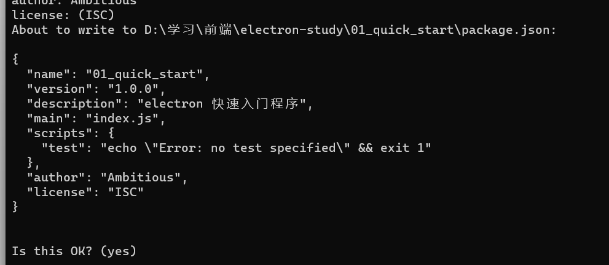
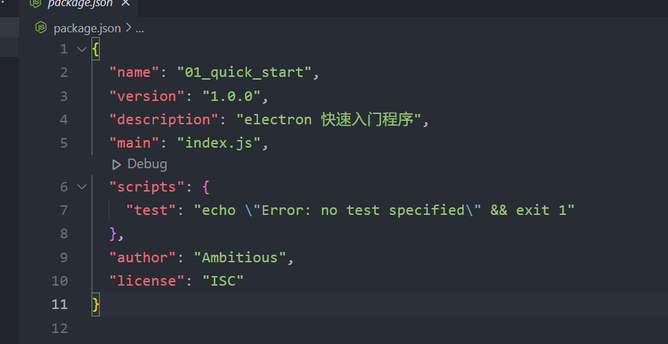
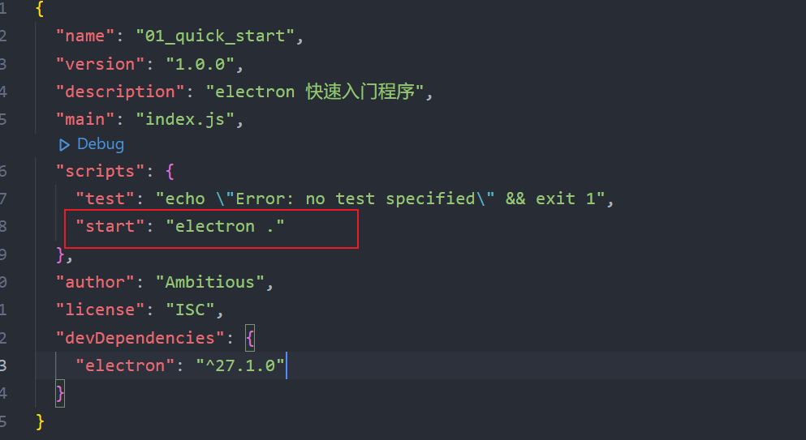
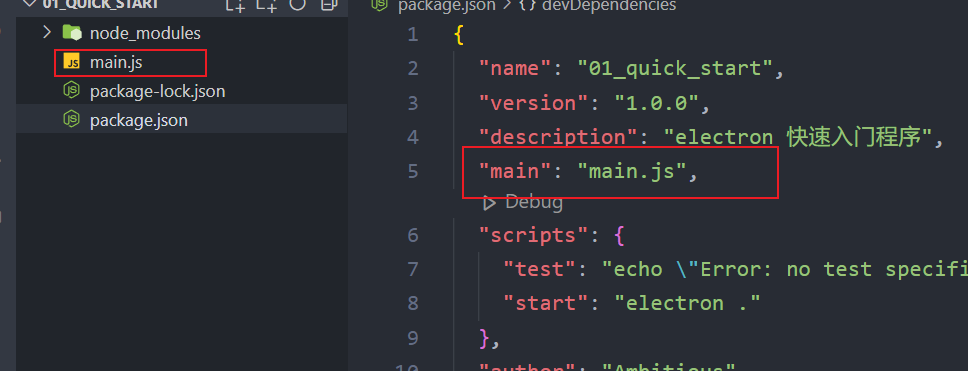
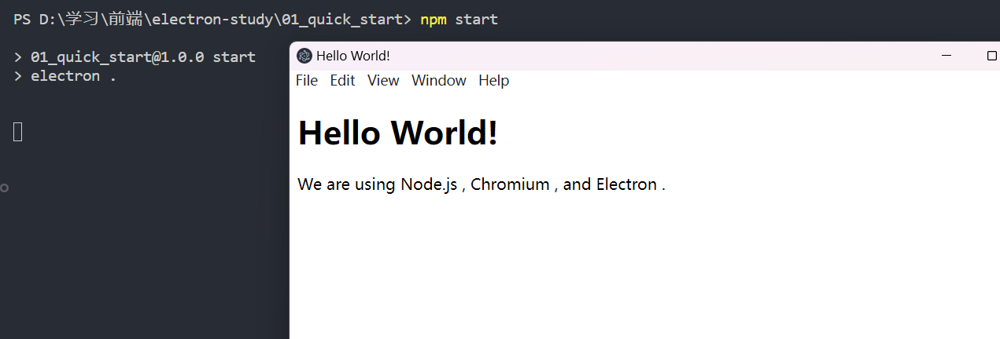
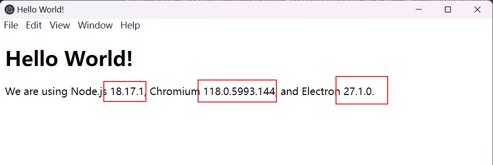
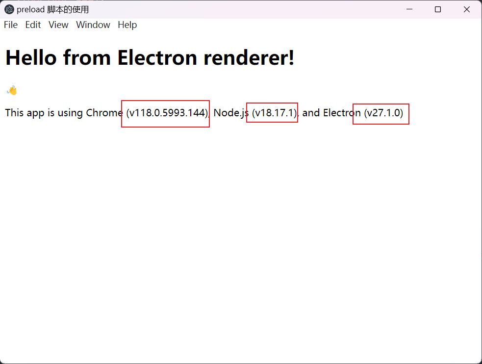
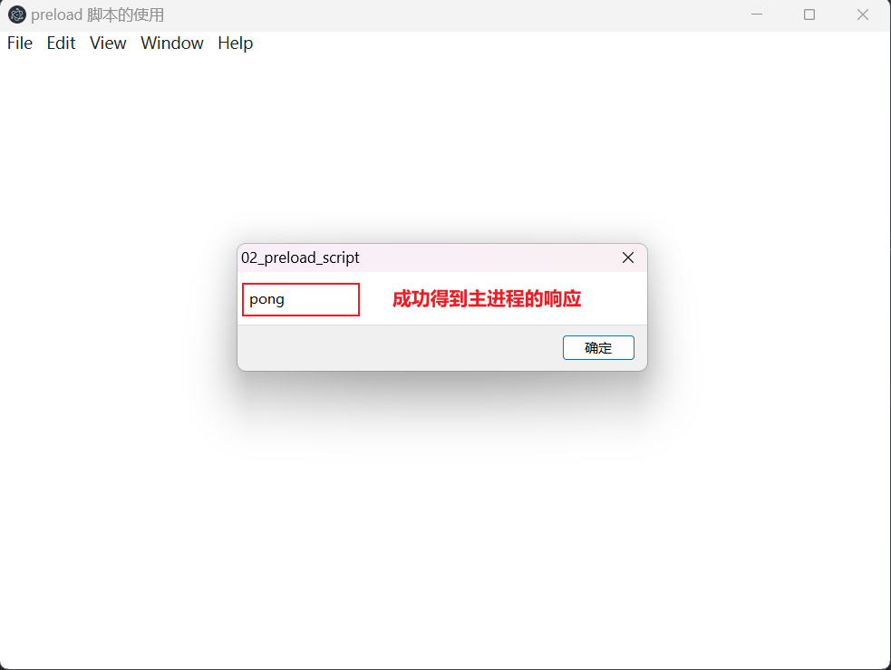

# ElectronStudy

此仓库用来存放个人学习 electron 工具的笔记和练习代码

> 官方文档：[https://www.electronjs.org/docs/latest/tutorial/quick-start](https://www.electronjs.org/docs/latest/tutorial/quick-start)
> 
> 仓库地址：[GitHub - AmbitiousJun/electron-study: electron 学习仓库，包含笔记和代码](https://github.com/AmbitiousJun/electron-study)

## 1. 快速入门程序

- 创建项目根目录，使用 npm 进行初始化
  
  ```shell
  mkdir 01_quick_start
  cd 01_quick_start
  npm init
  ```
  
  

- 使用 `vscode` 打开项目，可以看到 npm 初始化时生成的默认配置 `package.json`
  
  

- 安装 electron 依赖
  
  ```shell
  npm install --save-dev electron
  ```

- 修改 package.json 文件，添加一条 start 命令
  
  

- 新建入口文件 main.js
  
  > 注：为了与官方文档保持一致，这里将 package.json 的 main 属性更换为 main.js
  
  

- 使用 `npm start` 命令即可启动程序
  
  > 注：由于 main.js 中没有写任何代码，所以这里启动之后看不出效果是正常的
  
  

- 在根路径中创建 index.html 文件，用于嵌入之后打开的窗口中
  
  > 注：这段代码中，缺少了 node、chrome 和 electron 的版本号，将在程序启动后动态插入
  
  ```html
  <!DOCTYPE html>
  <html>
    <head>
      <meta charset="UTF-8">
      <!-- https://developer.mozilla.org/en-US/docs/Web/HTTP/CSP -->
      <meta http-equiv="Content-Security-Policy" content="default-src 'self'; script-src 'self'">
      <title>Hello World!</title>
    </head>
    <body>
      <h1>Hello World!</h1>
      We are using Node.js <span id="node-version"></span>,
      Chromium <span id="chrome-version"></span>,
      and Electron <span id="electron-version"></span>.
    </body>
  </html>
  ```

> 要在一个应用窗口加载页面，需要引入两个 electron 模块：
> 
> - `app`：控制整个应用的事件生命周期
> 
> - `BrowserWindow`：创建和管理一个或多个应用窗口
> 
> 由于 electron 是基于 nodejs，所以可以通过 CommonJS 规范来引入自定义模块

- 在 main.js 中，引入 app 和 BrowserWindow 两个模块
  
  ```js
  const { app, BrowserWindow } = require('electron')
  ```

- 实例化一个 BrowserWindow 对象，加载 index.html 页面
  
  ```js
  // 创建一个新窗口
  const createWindow = () => {
      const win = new BrowserWindow({
          width: 800,
          height: 600
      })
      // 把 index.html 页面加载到窗口中
      win.loadFile('index.html')
  }
  ```

> 创建窗口函数不是随时都能调用并成功生成一个窗口，需要等待 electron app 初始化完成并触发 ready 事件之后，才能调用。具体的，应该等待 `app.whenReady()` 完成，这是一个 Promise 对象。

- 创建窗口
  
  ```js
  // 等待 app 触发 ready 事件之后才能创建新窗口
  app.whenReady().then(() => {
      createWindow()
  })
  ```

- 运行程序，已经能够成功启动窗口，并加载页面
  
  > 注：此时页面还是静态的，还不能展示出版本号
  
  

- 监听所有窗口关闭事件，退出程序
  
  ```js
  // 当用户关闭掉所有的窗口时，就退出程序
  app.on('window-all-closed', () => {
      // 排除 MacOS
      if (process.platform !== 'darwin') app.quit()
  })
  ```

- 创建窗口适配 MacOS

> 由于在 Mac 系统中，所有窗口都关闭的时候，程序仍然处于运行状态，所以有可能出现 0 窗口情况。
> 
> 所以应该在 `app.whenReady()` 事件中监听 `activate` 事件，重新创建窗口

```js
// 等待 app 触发 ready 事件之后才能创建新窗口
app.whenReady().then(() => {
    createWindow()
    // 适配 MacOS
    app.on('activate', () => {
        // Mac 中有可能出现程序正在运行但没有窗口的情况
        if (BrowserWindow.getAllWindows().length === 0) createWindow()
    })
})
```

- 往页面中添加依赖版本号

> 一些必要的全局变量，如 `window`、`document` ，在 electron 的渲染进程加载完成之后才能使用，所以我们要让 electron 加载完成的时候再来执行我们的代码

首先在根目录中创建一个 `preload.js` 文件，在里面编写好渲染进程加载完成之后才能执行的代码：

```js
// 当 DOM 文档加载完成的时候，往页面中添加版本号
window.addEventListener('DOMContentLoaded', () => {
  const replaceText = (selector, text) => {
    const elm = document.getElementById(selector)
    if (elm) elm.innerText = text
  }
  for (const dependency of ['chrome', 'node', 'electron']) {
    replaceText(`${dependency}-version`, process.versions[dependency])
  }
})
```

接着，回到 `main.js` 中，在创建 BrowserWindow 对象时，指定 `preload.js` 文件路径：

```js
// 创建一个新窗口
const createWindow = () => {
    const win = new BrowserWindow({
        width: 800,
        height: 600,
        webPreferences: {
            preload: path.join(__dirname, 'preload.js')
        }
    })
    // 把 index.html 页面加载到窗口中
    win.loadFile('index.html')
}
```

这里使用到了 Node path API，通过 `__dirname` 可以获取 `main.js` 所在的目录绝对路径，再通过 `path.join()` 方法生成 `preload.js` 的绝对路径，这种写法可以避免在不同的平台上绝对路径不一致的问题。

- 再次运行程序



可以看到三个依赖版本号都成功地渲染到窗口中。

> 到这里，整个快速入门程序就完成了，总结一下做了哪些事：
> 
> 1. 初始化 Node.js 应用，安装 Electron 依赖
> 
> 2. 通过 `main.js` 文件去运行主进程，引入 electron 的 `app` 和 `BrowserWindow` 两个模块，创建了一个浏览器窗口然后展示自定义的 web 内容
> 
> 3. 通过 `preload.js`，在渲染进程加载完成之后，往页面中插入依赖版本号，把 `preload.js` 绝对路径配置到 `BrowserWindow` 对象构造器中就能生效

- 打包和发布

electron 推荐使用 `Electron Forge` 来快速构建镜像

首先，安装 `Electron Forge`：

```shell
npm install --save-dev @electron-forge/cli
```

然后运行 `import` 命令：

```shell
npx electron-forge import
```

最后，执行 `make` 命令，即可将程序打包到 `out` 目录下：

> 在运行这条指令时报了一大堆错误，但是生成的 `.exe` 文件是能够正常运行起来的

```shell
npm run make
```

## 2. 预加载脚本的使用

### 2.1 什么是预加载脚本

electron 应用程序通常包含两个进程，一个是主进程，另一个是渲染进程，渲染进程用来运行渲染 web 页面，为了安全性，在渲染进程中不能访问到 Node.js 的 API，而主进程中是可以完全访问整个操作系统以及通过 npm 安装的任何依赖。

要将不同的进程类型连接到一起，就需要使用到**预加载脚本（preload script）**。

### 2.2 如何使用预加载脚本来增强渲染进程

在预加载脚本中，我们能够访问到 HTML DOM 元素以及一部分的 Node.js 和 Electron 的 API

> **预加载脚本沙盒：**
> 
> 从 Electron 20 版本之后，预加载脚本都默认运行在沙盒中，并且不再能够访问完整的 Node.js 环境。
> 
> 我们只能通过一个预先填充好的 `require` 函数来访问这部分 API
> 
> | 可用 API      | 详情                                            |
> | ----------- | --------------------------------------------- |
> | Electron 模块 | 渲染进程                                          |
> | Node.js 模块  | events, timers, url                           |
> | 预填充全局变量     | Buffer, process, clearImmediate, setImmediate |

可以通过 `contextBridge` API 来实现在渲染进程中直接访问 electron 全局变量

首先，还是一样创建一个 `preload.js` 文件，引入 `contextBridge` 依赖，导出 node, chrome, electron 的版本号：

```js
const { contextBridge } = require('electron')

contextBridge.exposeInMainWorld("versions", {
  node: () => process.versions.node,
  chrome: () => process.versions.chrome,
  electron: () => process.versions.electron
})
```

接着，在 `main.js` 中引入 `preload.js` ，代码与第一章节一样，这里不再贴出来

最后，在 html 页面中，可以直接在全局变量 `versions` 中取到版本号：

```html
<!DOCTYPE html>
<html lang="en">
<head>
  <meta charset="UTF-8">
  <meta name="viewport" content="width=device-width, initial-scale=1.0">
  <title>preload 脚本的使用</title>
</head>
<body>
  <h1>Hello from Electron renderer!</h1>
  <p>👋</p>
  <p id="info"></p>

  <script>
    // 直接在渲染进程中读取通过 contextBridge 暴露的全局变量
    const info = document.getElementById('info')
    info.innerText = `This app is using Chrome (v${versions.chrome()}), Node.js (v${versions.node()}), and Electron (v${versions.electron()})`
  </script>
</body>
</html>
```

运行程序，查看效果如下：



### 2.3 如何在主进程和渲染进程之间通信

上文提到，electron 的主进程和渲染进程有自己独立的职责，它们之间是无法进行交互的。

也就是说，在**渲染进程**中无法直接访问 Node.js 的 API，在**主进程**中也无法访问 HTML DOM。

electron 提供了两个模块：`ipcMain` 和 `ipcRenderer` ，ipc 的含义是进程间通信（inter-process communication）。

在渲染进程，可以借助上一小节提到的 preload 脚本，以及 `ipcRenderer.invoke()` 方法触发一个处理器，这个方法返回一个 Promise 对象。

在主进程中，可以通过 `ipcMain.handle()` 方法来定义一个处理器，两个进程就能实现通信。

下面来写一个进程通信例子：

首先，在 preload 脚本中添加一个全局变量

```js
const { contextBridge, ipcRenderer } = require('electron')

contextBridge.exposeInMainWorld("versions", {
  // 这里不能直接把整个 ipcRenderer 暴露给渲染进程，防止产生代码安全隐患
  ping: () => ipcRenderer.invoke('ping')
})
```

> 这里务必要把 ipcRenderer 模块通过辅助函数的形式包裹起来，防止整个模块都暴露到渲染进程中，否则在渲染进程中，就能随意发送信息给主进程，进而带来安全隐患

接着，在 `main.js` 中，定义一个处理器

```js
const { app, BrowserWindow, ipcMain } = require('electron')

const path = require('node:path')

const createWindow = () => {
  const win = new BrowserWindow({
    width: 800,
    height: 600,
    webPreferences: {
      preload: path.join(__dirname, 'preload.js')
    }
  })
  win.loadFile('index.html')
}

app.whenReady().then(() => {
  // 处理渲染进程的 ping 事件
  ipcMain.handle('ping', () => 'pong')
  createWindow()
})
```

> 这里要确保处理器的定义位置是在创建窗口读取 html 文件之前，确保渲染进程调用 `invoke` 方法的时候主进程是准备好处理的

完成以上步骤之后，我们就可以在渲染进程中开始与主进程进行通信了

```js
// 调用 ping，与主进程进行通信
const func = async () => {
  const response = await window.versions.ping()
  alert(response)
}
func()
```

运行程序，查看结果：



> 总结：
> 
> preload 脚本是主进程与渲染进程的中间层，脚本中的代码会在 web 页面被加载到 browser window 之前进行调用。preload 脚本既能访问 DOM API 也能访问 Node.js 环境变量。通过 `contextBridge` API，可以把一些 Node.js 环境变量暴露给渲染进程使用。


