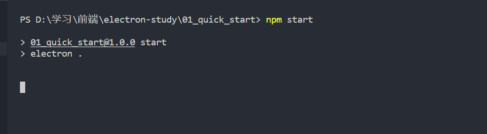

# ElectronStudy

此仓库用来存放个人学习 electron 工具的笔记和练习代码

> 官方文档：https://www.electronjs.org/docs/latest/tutorial/quick-start

## 1. 快速入门程序

- 创建项目根目录，使用 npm 进行初始化
  
  ```shell
  mkdir 01_quick_start
  cd 01_quick_start
  npm init
  ```
  
  

- 使用 `vscode` 打开项目，可以看到 npm 初始化时生成的默认配置 `package.json`
  
  

- 安装 electron 依赖
  
  ```shell
  npm install --save-dev electron
  ```

- 修改 package.json 文件，添加一条 start 命令
  
  

- 新建入口文件 main.js
  
  > 注：为了与官方文档保持一致，这里将 package.json 的 main 属性更换为 main.js
  
  

- 使用 `npm start` 命令即可启动程序
  
  > 注：由于 main.js 中没有写任何代码，所以这里启动之后看不出效果是正常的
  
  

- 在根路径中创建 index.html 文件，用于嵌入之后打开的窗口中
  
  > 注：这段代码中，缺少了 node、chrome 和 electron 的版本号，将在程序启动后动态插入
  
  ```html
  <!DOCTYPE html>
  <html>
    <head>
      <meta charset="UTF-8">
      <!-- https://developer.mozilla.org/en-US/docs/Web/HTTP/CSP -->
      <meta http-equiv="Content-Security-Policy" content="default-src 'self'; script-src 'self'">
      <title>Hello World!</title>
    </head>
    <body>
      <h1>Hello World!</h1>
      We are using Node.js <span id="node-version"></span>,
      Chromium <span id="chrome-version"></span>,
      and Electron <span id="electron-version"></span>.
    </body>
  </html>
  ```

> 要在一个应用窗口加载页面，需要引入两个 electron 模块：
> 
> - `app`：控制整个应用的事件生命周期
> 
> - `BrowserWindow`：创建和管理一个或多个应用窗口
> 
> 由于 electron 是基于 nodejs，所以可以通过 CommonJS 规范来引入自定义模块

- 在 main.js 中，引入 app 和 BrowserWindow 两个模块
  
  ```js
  const { app, BrowserWindow } = require('electron')
  ```

- 实例化一个 BrowserWindow 对象，加载 index.html 页面
  
  ```js
  // 创建一个新窗口
  const createWindow = () => {
      const win = new BrowserWindow({
          width: 800,
          height: 600
      })
      // 把 index.html 页面加载到窗口中
      win.loadFile('index.html')
  }
  ```

> 创建窗口函数不是随时都能调用并成功生成一个窗口，需要等待 electron app 初始化完成并触发 ready 事件之后，才能调用。具体的，应该等待 `app.whenReady()` 完成，这是一个 Promise 对象。

- 创建窗口
  
  ```js
  // 等待 app 触发 ready 事件之后才能创建新窗口
  app.whenReady().then(() => {
      createWindow()
  })
  ```

- 运行程序，已经能够成功启动窗口，并加载页面
  
  > 注：此时页面还是静态的，还不能展示出版本号
  
  

- 监听所有窗口关闭事件，退出程序
  
  ```js
  // 当用户关闭掉所有的窗口时，就退出程序
  app.on('window-all-closed', () => {
      // 排除 MacOS
      if (process.platform !== 'darwin') app.quit()
  })
  ```

- 创建窗口适配 MacOS
  
  > 由于在 Mac 系统中，所有窗口都关闭的时候，程序仍然处于运行状态，所以有可能出现 0 窗口情况。
  > 
  > 所以应该在 `app.whenReady()` 事件中监听 `activate` 事件，重新创建窗口
  
  ```js
  // 等待 app 触发 ready 事件之后才能创建新窗口
  app.whenReady().then(() => {
      createWindow()
      // 适配 MacOS
      app.on('activate', () => {
          // Mac 中有可能出现程序正在运行但没有窗口的情况
          if (BrowserWindow.getAllWindows.length === 0) createWindow()
      })
  })
  ```


